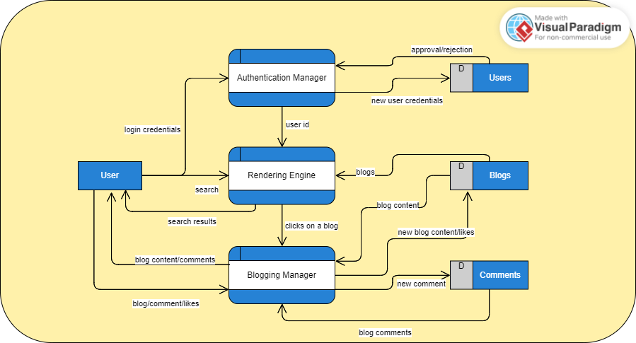
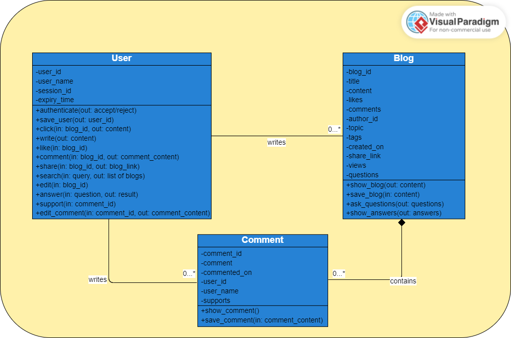

# Learning with Everything: blogr.ai

Blogr.ai is a web application built with the intent to deliver blogs related to vast topics that will make the readers learn and grow on those topics with articles written by outstanding authors.

Blogr.ai offers multiple solutions in the application that makes both authors and readers life better for making contents and learning.

The application contains AI-powered recommendation system for making personalized list of blogs that the readers will find interesting. Along with this, the application supports voice to text conversion that makes authors write the blogs with their voice only. Application uses natural language processing to remove unhealthy or harmful contents in the application. It also tries to understand the sentiment of the comments in any blog to gauge the mood the application provides. The articles support interactive contents like poll and quiz to make readers engage with the content and make their learning more fun.

## Requirements

## Data Flow Diagram

### Context Diagram

### Level 1 DFD

## Class Diagram

