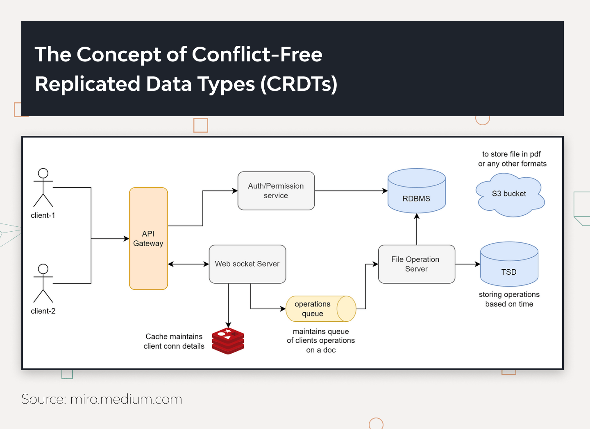

# System Design of the Collaborative Editing Feature

1. **API Gateway**: An API Gateway is the entry point for all client requests for backend services. It handles routing, composition, and protocol translation, ensuring efficient and secure communication between the frontend and backend. The API Gateway can also manage authentication, rate limiting, and logging.

2. **Authentication Service**: The authentication service verifies users’ identities when accessing the collaborative editor. It ensures that only authorized personnel can access and edit documents. This service manages user sessions and permissions by integrating with systems like OAuth, LDAP, or custom authentication mechanisms.

3. **Real-Time Synchronization Engine**: A Real-Time Synchronization Engine ensures that all user changes are instantly reflected across all instances of the document. Utilizing technologies like WebSockets or server-sent events, this engine facilitates real-time collaboration, allowing multiple users to see and interact with each other’s changes in real-time.

4. **Conflict Resolution Mechanism**: Conflicts are inevitable when multiple users edit the same content simultaneously in a collaborative setting. A Conflict Resolution Mechanism automatically merges changes and resolves conflicts, often based on Conflict-free Replicated Data Types (CRDTs) or Operational Transformation (OT). This ensures that all contributions are integrated smoothly without losing any user edits.

5. **Comment and Annotation Service**: The Comment and Annotation Service allows users to leave comments, suggestions, and notes on specific document parts. This feature enables team members to discuss changes and provide feedback directly within the document. Integrating this service enhances the collaborative experience by allowing asynchronous interactions alongside real-time editing.

6. **Document Management System**: The Document Management System (DMS) handles document storage, retrieval, and versioning. It ensures that each version of a document is saved and can be accessed or restored as needed. The DMS maintains links to other documents. References remain consistent and unchanged even as the content evolves.

7. **Notification and Alert System**: A Notification and Alert System informs users about important events, such as comments, document updates, or conflict resolutions. This system can send real-time alerts through various channels, including in-app notifications, emails, or SMS.

